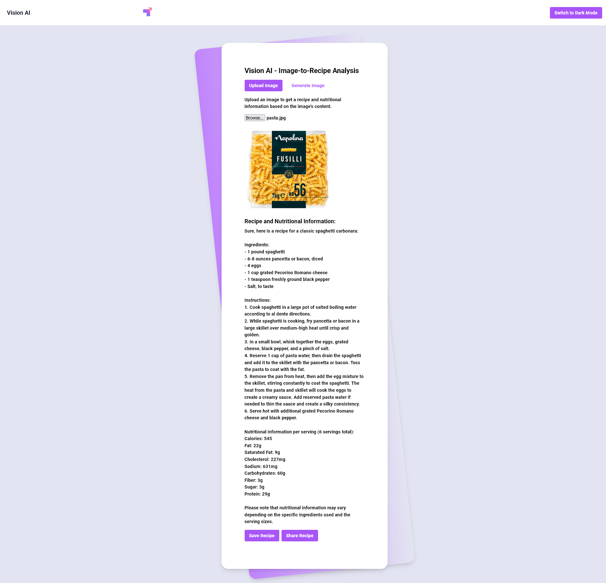

# Vision AI - Image to Recipe Analysis

## User Story   
AS AN individual interested in using up-to-date AI technologies and cooking 
I WANT to find a recipe and its nutritional information based on an ingredient that I have in my kitchen  
SO THAT I can utilize AI technology to help me make interest/health conscious decisions to make appealing meals.

## Description

The Vision AI app single-page application designed to produce recipes and nutritional information based on an image's content using AI technologies.
 
This app operates by prompting users to upload an image of an ingredient. Google reads the image with Google Lens, then passes the description to OpenAI’s API, the app retrieves a corresponding recipe. 
 
To enhance user experience, a loading spinner is implemented on the page during the recipe retrieval process.  
Additionally, the app offers a choice between light and dark mode, allowing users to select their preferred interface appearance. 

## Installation

Link to deployed application: https://main--eclectic-kringle-05e268.netlify.app/ 

## Usage 

Users can upload their ingredient image using the "Browse" button, once the image is uploaded a recipe will displayed on the page with the nutritional information below.

Screenshot of the app homepage: 

Example of an ingredient search plus nutritional information:
 

## Technologies Used
- React
- Tailwind
- Google Lens API
- OpenAI API
- Netlify

